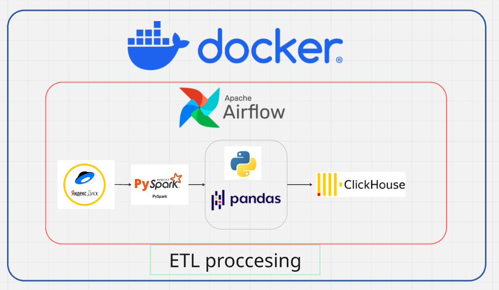
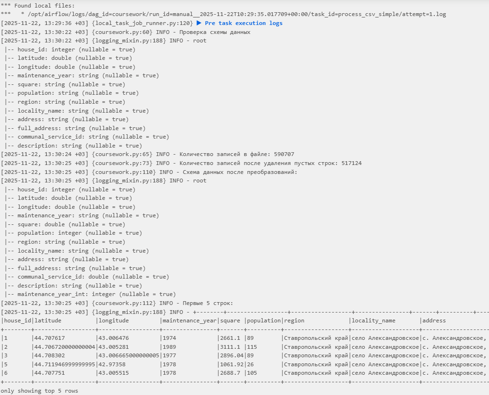
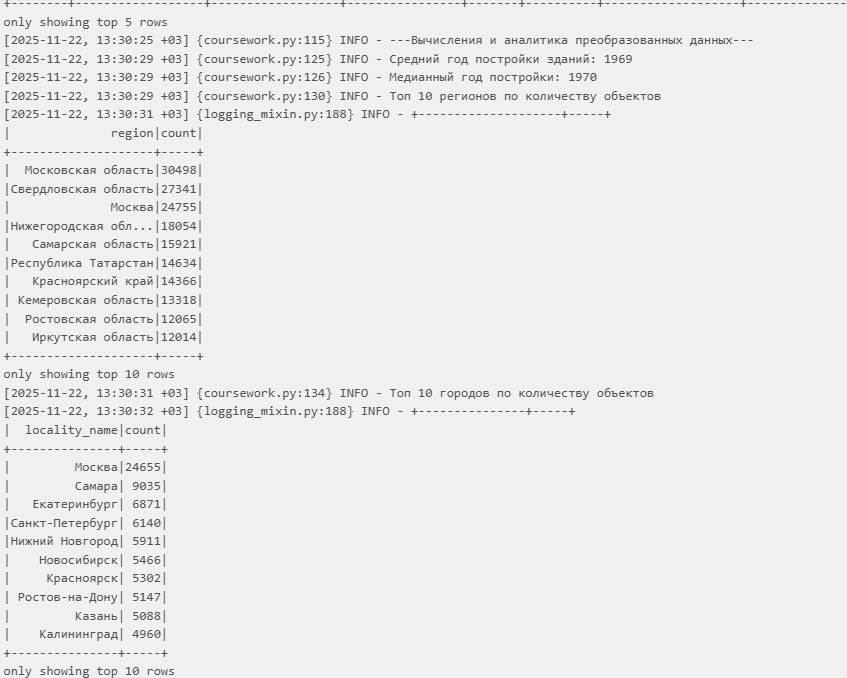
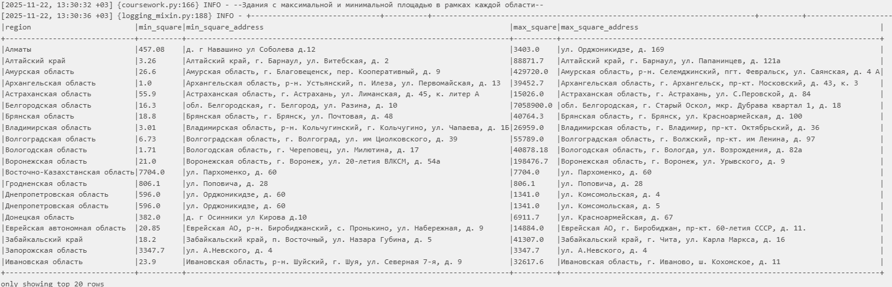
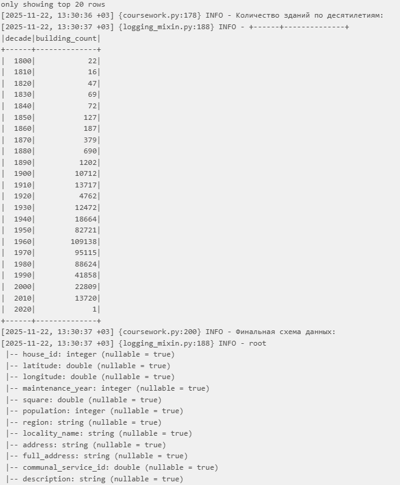
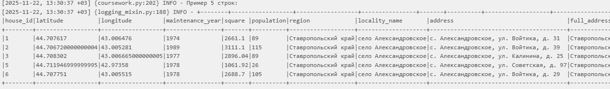
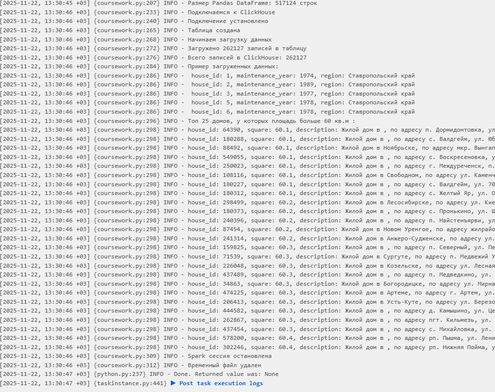
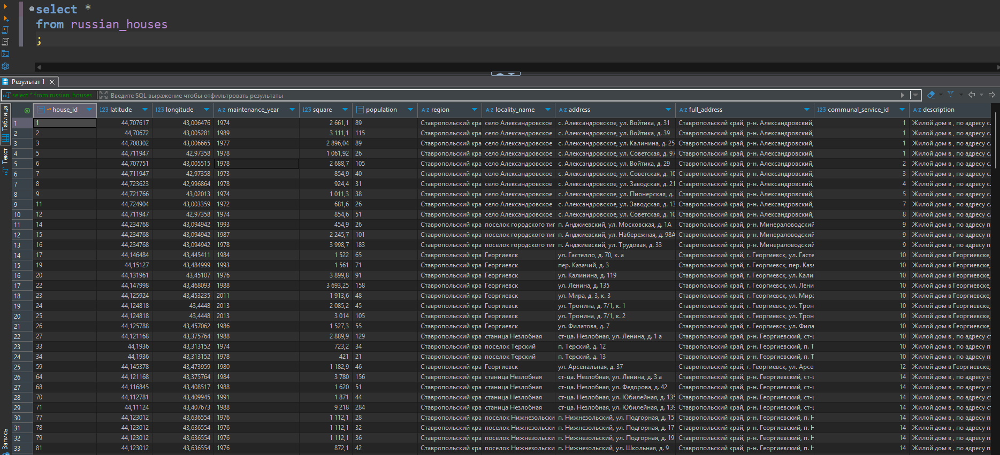

# Итоговая работа курса "Профессия Data Engineer с нуля до junior"

# :computer: О проекте:

В рамках данного проекта рассматривается разработка и реализация ETL (Extract, Transform, Load) процесса для обработки данных с использованием современных технологий и инструментов. В частности, внимание уделяется интеграции Apache Airflow, Docker и PySpark в экосистему Python.

Apache Airflow выступает в роли оркестратора, обеспечивая координацию и управление выполнением задач в рамках ETL-процесса. Docker предоставляет контейнеризацию, что позволяет гарантировать воспроизводимость и изолированность среды выполнения. PySpark, в свою очередь, обеспечивает высокопроизводительные вычисления, что критично для обработки больших объемов данных.ClickHouse выступает в роли хранилища обработанных данных.

##  :newspaper: Описание задач итогового задания №8:

Обратите внимание, что в проекте используются PySpark и Clickhouse. PySpark в airflow в docker-compose нету! Его необходимо добавить самостоятельно. Куда вставить в docker-compose - задача самостоятельная. 

0. Предварительно разверните docker-compose из первых степов! Шаги 1-7 должны быть сделаны в DAG.

1. Загрузите файл данных в DataFrame PySpark. Обязательно выведите количество строк.

2. Убедитесь, что данные корректно прочитаны (правильный формат, отсутствие пустых строк).

3. Преобразуйте текстовые и числовые поля в соответствующие типы данных (например, дата, число).

4. Вычислите средний и медианный год постройки зданий.

5. Определите топ-10 областей и городов с наибольшим количеством объектов.

6. Найдите здания с максимальной и минимальной площадью в рамках каждой области.

7. Определите количество зданий по десятилетиям (например, сколько зданий построено в 1950-х, 1960-х и т.д.).

8. Создайте схему таблицы в ClickHouse, которая будет соответствовать структуре ваших данных. Это можно сделать не через airflow.

9. Настройте соединение с ClickHouse из скрипта, учтите, что сделать это необходимо в airflow.

10. Загрузите обработанные данные из DataFrame в таблицу в ClickHouse (airflow)

11. Выполните SQL скрипт в Python, который выведет топ 25 домов, у которых площадь больше 60 кв.м (airflow)

## :page_with_curl: Наглядный план структуры проекта:

## :microscope: Логи выполненного проекта:

## :bridge_at_night: Заключение 
В ходе реализации проекта были идентифицированы и успешно устранены многочисленные проблемы, связанные с интеграцией сложных технологических решений и обработкой некорректных данных. Данный этап включал в себя детальный анализ и оптимизацию процессов интеграции, что позволило значительно повысить эффективность и надежность системы. Особое внимание уделялось вопросам синхронизации разнородных технологий и валидации данных, что обеспечило минимизацию рисков и улучшение качества обработки данных.
## :telephone_receiver: Связаться со мной
* *email* - kim488307@gmail.com
* *Telegram* - @arthur_kim
